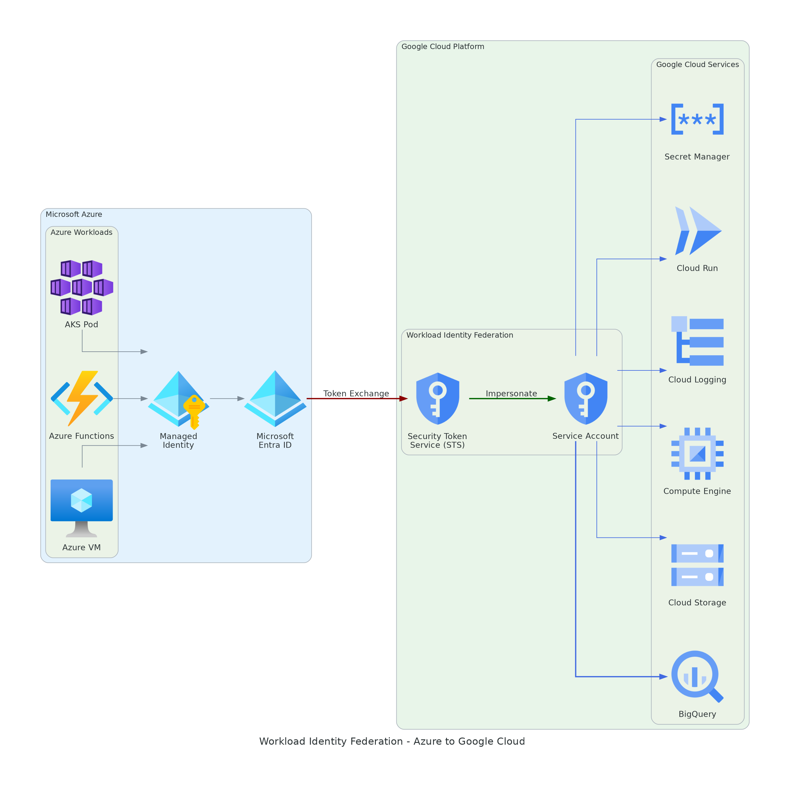
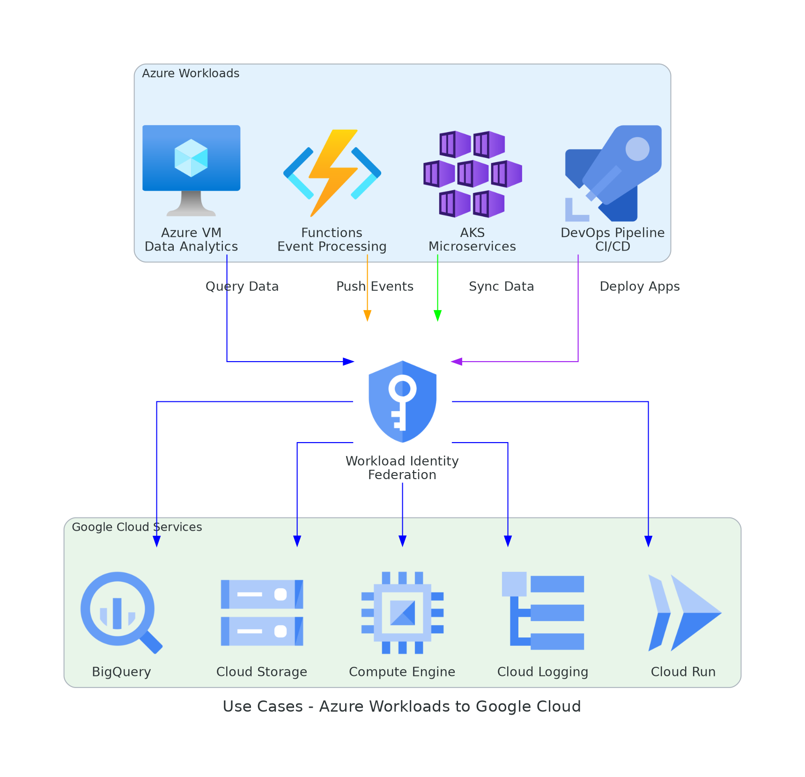

# HƯỚNG DẪN TRIỂN KHAI WORKLOAD IDENTITY FEDERATION GIỮA AZURE VÀ GOOGLE CLOUD


---

## 1. Giới thiệu tổng quan

### 1.1 Bối cảnh

Trong mô hình đa đám mây, các ứng dụng chạy trên Azure thường cần truy cập dịch vụ Google Cloud. Thay vì sử dụng Service Account Key (tiềm ẩn rủi ro bảo mật), Google Cloud Workload Identity Federation cho phép xác thực trực tiếp thông qua Microsoft Entra ID (Azure AD) và Managed Identity, hoàn toàn không cần lưu trữ khóa bí mật.

### 1.2 Kiến trúc tổng thể



### 1.3 Luồng xác thực chi tiết


1. Workload trên Azure sử dụng Managed Identity để yêu cầu access token từ Microsoft Entra ID.
2. Access token (OIDC JWT) được gửi tới Google Security Token Service (STS) để trao đổi.
3. Google STS xác minh token qua Entra ID OIDC discovery endpoint, cấp phát Federated Token.
4. Federated Token được dùng để mạo danh Google Cloud Service Account.
5. Access Token ngắn hạn (1 giờ) được cấp phát để gọi Google Cloud API.

### 1.4 So sánh phương pháp xác thực

| Tiêu chí | Service Account Key | Workload Identity Federation |
|----------|--------------------|-----------------------------|
| Lưu trữ khóa bí mật | Có - cần bảo vệ tệp JSON | Không có khóa để lưu trữ |
| Xoay vòng khóa | Thủ công | Tự động - token hết hạn sau 1 giờ |
| Rủi ro lộ thông tin | Cao | Không có tệp khóa để lộ |
| Kiểm toán | Chỉ biết Service Account | Truy vết được danh tính Azure gốc |
| Tuân thủ bảo mật | Không đạt nhiều tiêu chuẩn | Phù hợp Zero Trust, SOC2, ISO 27001 |

## 2. Chi phí giải pháp

| Hạng mục | Chi phí |
|----------|---------|
| Workload Identity Pool và Provider | Miễn phí |
| Trao đổi token (STS API) | Miễn phí |
| Service Account impersonation | Miễn phí |
| Azure Managed Identity | Miễn phí |
| Microsoft Entra ID App Registration | Miễn phí |

Chi phí chỉ phát sinh từ việc sử dụng các dịch vụ Google Cloud đích (BigQuery, Cloud Storage, ...).

## 3. Các kịch bản ứng dụng



| STT | Kịch bản | Nguồn Azure | Đích GCP | Role cần cấp |
|-----|----------|-------------|----------|-------------|
| 1 | Phân tích dữ liệu | Azure VM | BigQuery | bigquery.dataViewer + bigquery.jobUser |
| 2 | Đồng bộ và sao lưu dữ liệu | Azure VM | Cloud Storage | storage.objectAdmin |
| 3 | Kiểm kê tài nguyên đa đám mây | Azure VM | Compute Engine | compute.viewer |
| 4 | Quản lý hạ tầng bằng Terraform | Azure VM / DevOps | Terraform resources | Tùy loại tài nguyên |
| 5 | Tập trung nhật ký | Azure VM | Cloud Logging | logging.logWriter |
| 6 | Xử lý sự kiện | Azure Functions | BigQuery / GCS | bigquery.dataEditor |
| 7 | Microservices | AKS Pod | Mọi dịch vụ GCP | Tùy dịch vụ |
| 8 | Triển khai CI/CD | Azure DevOps Pipeline | Cloud Run / GKE | run.admin |

---

## 4. Điều kiện tiên quyết

### Phía Azure
- Azure subscription với quyền quản trị Entra ID
- Microsoft Entra ID Application đã đăng ký
- Workload có Managed Identity (system-assigned hoặc user-assigned)

### Phía Google Cloud
- Google Cloud Project với billing đã bật
- Quyền IAM Admin + Service Account Admin
- gcloud CLI phiên bản 363.0.0 trở lên

---

## 5. Thiết lập từng bước

### 5.1 Đăng ký Microsoft Entra ID Application

1. Truy cập Azure Portal > Microsoft Entra ID > App registrations > New registration
2. Đặt tên: gcp-workload-identity
3. Supported account types: Accounts in this organizational directory only
4. Nhấn Register
5. Ghi nhận Application (client) ID và Directory (tenant) ID
6. Vào Expose an API > Set Application ID URI

[CHỤP HÌNH: Azure Portal - App Registration với Application ID URI]

### 5.2 Gán Managed Identity cho workload Azure

```bash
# Tạo user-assigned managed identity
az identity create \
  --name gcp-wif-identity \
  --resource-group <RESOURCE_GROUP>

# Gán cho VM
az vm identity assign \
  --name <VM_NAME> \
  --resource-group <RESOURCE_GROUP> \
  --identities gcp-wif-identity
```

Ghi nhận Object ID của managed identity.

[CHỤP HÌNH: Azure Portal - Managed Identity đã gán cho VM]

### 5.3 Bật API trên Google Cloud

```bash
gcloud services enable \
  iam.googleapis.com sts.googleapis.com iamcredentials.googleapis.com \
  bigquery.googleapis.com storage.googleapis.com logging.googleapis.com \
  --project=<PROJECT_ID>
```

### 5.4 Tạo Workload Identity Pool

```bash
gcloud iam workload-identity-pools create azure-pool \
  --project=<PROJECT_ID> \
  --location=global \
  --display-name="Azure Pool"
```

### 5.5 Tạo OIDC Provider cho Azure

```bash
gcloud iam workload-identity-pools providers create-oidc azure-provider \
  --project=<PROJECT_ID> \
  --location=global \
  --workload-identity-pool=azure-pool \
  --issuer-uri="https://sts.windows.net/<TENANT_ID>/" \
  --allowed-audiences="<APPLICATION_ID_URI>" \
  --attribute-mapping="google.subject=assertion.sub"
```

Điểm khác biệt so với AWS: Azure sử dụng loại provider OIDC thay vì AWS provider.

### 5.6 Tạo Service Account

```bash
gcloud iam service-accounts create azure-workload-sa \
  --project=<PROJECT_ID> \
  --display-name="Azure Workload SA"
```

### 5.7 Cấp quyền mạo danh Service Account

```bash
MEMBER="principal://iam.googleapis.com/projects/<PROJECT_NUMBER>/locations/global/workloadIdentityPools/azure-pool/subject/<MANAGED_IDENTITY_OBJECT_ID>"

gcloud iam service-accounts add-iam-policy-binding \
  azure-workload-sa@<PROJECT_ID>.iam.gserviceaccount.com \
  --role=roles/iam.workloadIdentityUser \
  --member="${MEMBER}"

gcloud iam service-accounts add-iam-policy-binding \
  azure-workload-sa@<PROJECT_ID>.iam.gserviceaccount.com \
  --role=roles/iam.serviceAccountTokenCreator \
  --member="${MEMBER}"
```

Lưu ý: MANAGED_IDENTITY_OBJECT_ID là Object ID (GUID) của managed identity, không phải Client ID.

### 5.8 Cấp quyền truy cập dịch vụ Google Cloud

```bash
gcloud projects add-iam-policy-binding <PROJECT_ID> \
  --role=roles/bigquery.dataViewer \
  --member="serviceAccount:azure-workload-sa@<PROJECT_ID>.iam.gserviceaccount.com"

gcloud projects add-iam-policy-binding <PROJECT_ID> \
  --role=roles/bigquery.jobUser \
  --member="serviceAccount:azure-workload-sa@<PROJECT_ID>.iam.gserviceaccount.com"
```

### 5.9 Tạo tệp cấu hình xác thực

```bash
gcloud iam workload-identity-pools create-cred-config \
  projects/<PROJECT_NUMBER>/locations/global/workloadIdentityPools/azure-pool/providers/azure-provider \
  --service-account=azure-workload-sa@<PROJECT_ID>.iam.gserviceaccount.com \
  --azure \
  --app-id-uri=<APPLICATION_ID_URI> \
  --output-file=gcp-credentials.json
```

### 5.10 Cấu hình trên Azure workload

```bash
export GOOGLE_APPLICATION_CREDENTIALS=/path/to/gcp-credentials.json
pip install google-cloud-bigquery google-cloud-storage google-cloud-logging
```

---

## 6. Điểm khác biệt giữa Azure và AWS

| Khía cạnh | AWS | Azure |
|-----------|-----|-------|
| Loại provider | create-aws | create-oidc |
| Nguồn danh tính | IAM Role + Instance Metadata | Managed Identity + Entra ID |
| Loại token | AWS STS (SigV4) | OIDC JWT |
| Định danh chủ thể | AWS ARN | Managed Identity Object ID |
| Issuer URI | Không cần (tích hợp sẵn) | https://sts.windows.net/<TENANT_ID>/ |
| Thiết lập thêm | Không cần phía AWS | Đăng ký Entra ID App + App ID URI |
| Tham số credential config | --aws --enable-imdsv2 | --azure --app-id-uri=<URI> |

---

## 7. Xử lý sự cố

| Lỗi | Nguyên nhân | Cách xử lý |
|-----|-------------|------------|
| Permission iam.serviceAccounts.getAccessToken denied | Thiếu role serviceAccountTokenCreator | Cấp thêm role, chờ 60 giây |
| Invalid audience | Application ID URI không khớp | Kiểm tra --allowed-audiences khớp với App ID URI trong Entra ID |
| Token validation failed | Sai issuer URI hoặc tenant ID | Kiểm tra format: https://sts.windows.net/<TENANT_ID>/ (có dấu / cuối) |
| Subject mismatch | Sai Object ID | Dùng Object ID của Managed Identity, không phải Client ID |


---

## 9. Tài liệu tham khảo

1. Google Cloud - Workload Identity Federation with Azure
   https://cloud.google.com/iam/docs/workload-identity-federation-with-other-clouds

2. Azure - Managed Identities
   https://learn.microsoft.com/en-us/azure/active-directory/managed-identities-azure-resources/overview

3. Azure - App Registration
   https://learn.microsoft.com/en-us/azure/active-directory/develop/quickstart-register-app

4. Terraform - Google Cloud Provider
   https://registry.terraform.io/providers/hashicorp/google/latest/docs
